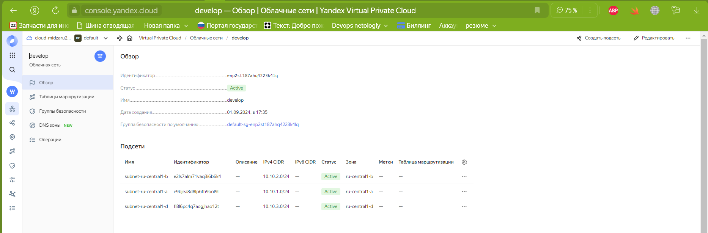
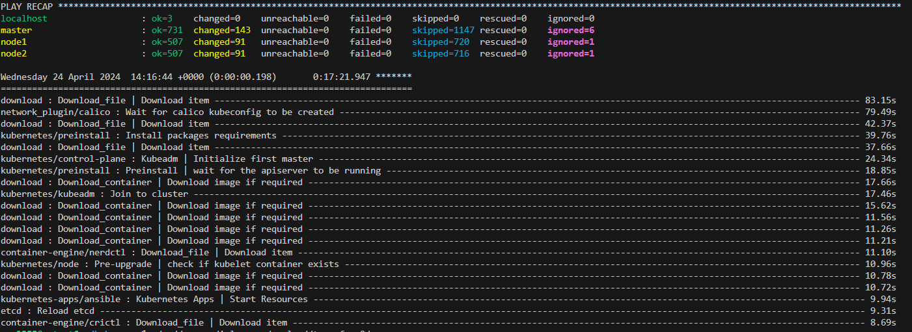

# Дипломный практикум в Yandex.Cloud
  * [Цели:](#цели)
  * [Этапы выполнения:](#этапы-выполнения)
     * [Создание облачной инфраструктуры](#создание-облачной-инфраструктуры)
     * [Создание Kubernetes кластера](#создание-kubernetes-кластера)
     * [Создание тестового приложения](#создание-тестового-приложения)
     * [Подготовка cистемы мониторинга и деплой приложения](#подготовка-cистемы-мониторинга-и-деплой-приложения)
     * [Установка и настройка CI/CD](#установка-и-настройка-cicd)
  * [Что необходимо для сдачи задания?](#что-необходимо-для-сдачи-задания)
  * [Как правильно задавать вопросы дипломному руководителю?](#как-правильно-задавать-вопросы-дипломному-руководителю)

**Перед началом работы над дипломным заданием изучите [Инструкция по экономии облачных ресурсов](https://github.com/netology-code/devops-materials/blob/master/cloudwork.MD).**

---
## Цели:

1. Подготовить облачную инфраструктуру на базе облачного провайдера Яндекс.Облако.
2. Запустить и сконфигурировать Kubernetes кластер.
3. Установить и настроить систему мониторинга.
4. Настроить и автоматизировать сборку тестового приложения с использованием Docker-контейнеров.
5. Настроить CI для автоматической сборки и тестирования.
6. Настроить CD для автоматического развёртывания приложения.

---
## Этапы выполнения:


## Создание облачной инфраструктуры

<details><summary>Задание №1 </summary>

Для начала необходимо подготовить облачную инфраструктуру в ЯО при помощи [Terraform](https://www.terraform.io/).

Особенности выполнения:

- Бюджет купона ограничен, что следует иметь в виду при проектировании инфраструктуры и использовании ресурсов;
Для облачного k8s используйте региональный мастер(неотказоустойчивый). Для self-hosted k8s минимизируйте ресурсы ВМ и долю ЦПУ. В обоих вариантах используйте прерываемые ВМ для worker nodes.
- Следует использовать версию [Terraform](https://www.terraform.io/) не старше 1.5.x .

Предварительная подготовка к установке и запуску Kubernetes кластера.

1. Создайте сервисный аккаунт, который будет в дальнейшем использоваться Terraform для работы с инфраструктурой с необходимыми и достаточными правами. Не стоит использовать права суперпользователя
2. Подготовьте [backend](https://www.terraform.io/docs/language/settings/backends/index.html) для Terraform:  
   а. Рекомендуемый вариант: S3 bucket в созданном ЯО аккаунте(создание бакета через TF)
   б. Альтернативный вариант:  [Terraform Cloud](https://app.terraform.io/)  
3. Создайте VPC с подсетями в разных зонах доступности.
4. Убедитесь, что теперь вы можете выполнить команды `terraform destroy` и `terraform apply` без дополнительных ручных действий.
5. В случае использования [Terraform Cloud](https://app.terraform.io/) в качестве [backend](https://www.terraform.io/docs/language/settings/backends/index.html) убедитесь, что применение изменений успешно проходит, используя web-интерфейс Terraform cloud.

</details>

Ожидаемые результаты:

1. Terraform сконфигурирован и создание инфраструктуры посредством Terraform возможно без дополнительных ручных действий.
2. Полученная конфигурация инфраструктуры является предварительной, поэтому в ходе дальнейшего выполнения задания возможны изменения.

---

## Решение

1. Создал сервисный аккаунт для управления облаком с помощью terraform:

```shell
zag1988@mytest6:~/devops-diplom-yandexcloud/terraform2$ yc iam service-account list
+----------------------+-------------+
|          ID          |    NAME     |
+----------------------+-------------+
| aje78fj1njr9ki9jaem4 | terraform   |
| ajen2m037tokpdof7lp1 | midzaru2011 |
+----------------------+-------------+

```

2. Установленная версия terraform:

```shell
zag1988@mytest6:~/devops-diplom-yandexcloud/terraform2$ terraform --version
Terraform v1.4.6
on linux_amd64
+ provider registry.terraform.io/hashicorp/local v2.5.1
+ provider registry.terraform.io/yandex-cloud/yandex v0.116.0

Your version of Terraform is out of date! The latest version
is 1.8.1. You can update by downloading from https://www.terraform.io/downloads.html
```

3. Конфигурация terraform для создания требуемой архитектуры [terraform2](terraform2):
   В данной конфигурации создаются:
   - VPC c подсетями разных зонах доступности:
   
   - Создается bucket, куда отправляется файл terraform.tfstate, который используется в качестве backend:
   

4. Также были созданы четыре виртуальные машины, которые будут использованы в дальнейшем для установки кластера k8s и jenkins:

```shell
zag1988@mytest6:~/devops-diplom-yandexcloud/terraform2$ yc compute instance list
+----------------------+---------+---------------+---------+-----------------+-------------+
|          ID          |  NAME   |    ZONE ID    | STATUS  |   EXTERNAL IP   | INTERNAL IP |
+----------------------+---------+---------------+---------+-----------------+-------------+
| epd0dvnl64d2ti00eso7 | worker1 | ru-central1-b | RUNNING | 84.201.167.176  | 10.0.2.22   |
| fhm0csp7h02pl7jmavav | master  | ru-central1-a | RUNNING | 158.160.32.251  | 10.0.1.6    |
| fhm1mur16p0hg1tbdrrv | mytest6 | ru-central1-a | RUNNING | 158.160.121.102 | 10.128.0.35 |
| fhme9n84271f51eramfj | jenkins | ru-central1-a | RUNNING | 51.250.90.142   | 10.0.1.33   |
| fv4458pgl175iobchajn | worker2 | ru-central1-d | RUNNING | 158.160.153.252 | 10.0.3.17   |
+----------------------+---------+---------------+---------+-----------------+-------------+
```

### Создание Kubernetes кластера

<details><summary>Задание №2 </summary>
На этом этапе необходимо создать [Kubernetes](https://kubernetes.io/ru/docs/concepts/overview/what-is-kubernetes/) кластер на базе предварительно созданной инфраструктуры.   Требуется обеспечить доступ к ресурсам из Интернета.

Это можно сделать двумя способами:

1. Рекомендуемый вариант: самостоятельная установка Kubernetes кластера.  
   а. При помощи Terraform подготовить как минимум 3 виртуальных машины Compute Cloud для создания Kubernetes-кластера. Тип виртуальной машины следует выбрать самостоятельно с учётом требовании к производительности и стоимости. Если в дальнейшем поймете, что необходимо сменить тип инстанса, используйте Terraform для внесения изменений.  
   б. Подготовить [ansible](https://www.ansible.com/) конфигурации, можно воспользоваться, например [Kubespray](https://kubernetes.io/docs/setup/production-environment/tools/kubespray/)  
   в. Задеплоить Kubernetes на подготовленные ранее инстансы, в случае нехватки каких-либо ресурсов вы всегда можете создать их при помощи Terraform.
2. Альтернативный вариант: воспользуйтесь сервисом [Yandex Managed Service for Kubernetes](https://cloud.yandex.ru/services/managed-kubernetes)  
  а. С помощью terraform resource для [kubernetes](https://registry.terraform.io/providers/yandex-cloud/yandex/latest/docs/resources/kubernetes_cluster) создать **региональный** мастер kubernetes с размещением нод в разных 3 подсетях      
  б. С помощью terraform resource для [kubernetes node group](https://registry.terraform.io/providers/yandex-cloud/yandex/latest/docs/resources/kubernetes_node_group)

</details>

Ожидаемый результат:

1. Работоспособный Kubernetes кластер.
2. В файле `~/.kube/config` находятся данные для доступа к кластеру.
3. Команда `kubectl get pods --all-namespaces` отрабатывает без ошибок.

---

## Решение

1. Для установки кластера  k8s воспользовался отредактированной конфигурацией ansible из [Kubespray](https://kubernetes.io/docs/setup/production-environment/tools/kubespray/):
   - При развертывании игфраструктуры через terraform, для использования ansible, прокинули публичные ключи [main.tf](terraform2/main.tf);
   - Склонировал репозиторий Kubespray: **git clone https://github.com/kubernetes-sigs/kubespray.git** на локальную машину;
   - Переименовал каталог с inventory: **cd kubespray/ &&  cp -rfp inventory/sample inventory/mycluster**;
   - Установил необходимые зависимости для выполнения playbook kubespray из requirements: **pip install -U -r requirements.txt**
   - Заменил inventory файл host.ymal в каталоге ~/kubespray/inventory/mycluster/group_vars/ на динамически сгененированный terraform [pre_kubespray](terraform2/pre_kubespray.tf) на [hosts.yaml](terraform2/hosts.yaml); 
   - Для того, чтобы кластер k8s был доступен из интернета, в конфигах изменил параметр supplementary_addresses_in_ssl_keys [supplementary_addresses_in_ssl_keys](kubespray/mycluster/group_vars/k8s_cluster/k8s-cluster.yml) на "master_external_ipv4": [158.160.32.251]
   - Запустил playbook для установки кластера k8s: **ansible-playbook -i inventory/mycluster/group_vars/hosts.yaml cluster.yml -b -v**
   - Playbook успешно завершился:
   
   - Проверил, что кластер доступен по внешнему адресу, который задавали в конфигах:

   
   - заходим на мастер ноду кластера, и проверяем доступность конфишурационных файлов и созданных pods:
```shell
   ubuntu@master:~$ cat ~/.kube/config 
apiVersion: v1
clusters:
- cluster:
    certificate-authority-data: LS0tLS1CRUdJTiBDRVJUSUZJQ0FURS0tLS0tCk1JSURCVENDQWUyZ0F3SUJBZ0lJUDAza0dCZmlsZDB3RFFZSktvWklodmNOQVFFTEJRQXdGVEVUTUJFR0ExVUUKQXhNS2EzVmlaWEp1WlhSbGN6QWVGdzB5TkRBME1qUXhOak14TXpaYUZ3MHpOREEwTWpJeE5qTTJNelphTUJVeApFekFSQmdOVkJBTVRDbXQxWW1WeWJtVjBaWE13Z2dFaU1BMEdDU3FHU0liM0RRRUJBUVVBQTRJQkR3QXdnZ0VLCkFvSUJBUUMzSVBnenA4YXU4VUx3MUJQQUJ6eDBmd29GYW1HVDVGZjlSZ09idmdNK3pLTlh1cXRmK3NNM3ZSbSsKWmx5N3F2SnJsSzc3b2V2NUR0dm5ScGd6OXQzMklTYkY1WHAwblRINkVaTXBRUHRnQVhoY3NqbG5kYXpMMEZpQgp1aERFakVhNlFyb2FaOXlJcTdjSHlFUWRyd0gxWklvNWtmTlJBZW1RQm8rU1BLdXdxMXZDUGZMcVBsTWtGczl3Ck8yNDRmU3NwT00wVCt0VGlnU3JmbjlHaXY2b1RMNUxjL3RGYzQxa091a2NWVnIwellXdTFUbG5PUmJvWVM5Ky8KS2lQNTF5SzUvVkVmZWsvRUhVNDVRSUNUVzJqWnpxVlpHdmNiNncwWGZzTmkvWG9qNUpRaVdidnFNSWJpbzRpTwo2S2V6Mkh2YUVzUVh6azNNV2RoTkxzRnlyT0RGQWdNQkFBR2pXVEJYTUE0R0ExVWREd0VCL3dRRUF3SUNwREFQCkJnTlZIUk1CQWY4RUJUQURBUUgvTUIwR0ExVWREZ1FXQkJUYVJsd0NORHpSVTQ4bVIwT21vekgxTkNCVUx6QVYKQmdOVkhSRUVEakFNZ2dwcmRXSmxjbTVsZEdWek1BMEdDU3FHU0liM0RRRUJDd1VBQTRJQkFRQnAvaHdjdkZJeQpGVjhxWVVkTEoyWjk1bDkwenZoalVtRzRXeHpSRzk0d0VoTU9jVUV2WFQxNnF1TG1ERlZURHdudFBlcllBR1NkCmw5UCsvb0piei81RnFmMUpvUVpxeWs5a0ZHQjBwVHljejkrODV2RlR2NWREYjd2OURFc0dPVXF5VkFDRjdvT24Kc1orWXNyMDBMVGZCanpub0UybHZnRTNVTWZ5NzlrVE5HbUhDb0hMOEdERVFNTGpHVUlTYWdCN21MaUt0WFJUOApKMjhWWGVYWkZ5MW1MNVN0N1JQUzN2aWVKL3UvRmN6L0ZMVlZBaHFsejFRSXRPVFVqSzFwRk1iRUZHL29vc0JaCktWY2NmZUNjR3dlRGlRZFVPWGZHc1FWTFozU2lWTTMrWG1PTWlEd1dCZyttQkovV1JOU09XWTRVWVdBM2lUSjgKcEdsSW9lWWJ3UldlCi0tLS0tRU5EIENFUlRJRklDQVRFLS0tLS0K
    server: https://158.160.32.251:6443
  name: cluster.local
contexts:
- context:
    cluster: cluster.local
    user: kubernetes-admin
  name: kubernetes-admin@cluster.local
current-context: kubernetes-admin@cluster.local
kind: Config
preferences: {}
users:
- name: kubernetes-admin
  user:
    client-certificate-data: LS0tLS1CRUdJTiBDRVJUSUZJQ0FURS0tLS0tCk1JSURJVENDQWdtZ0F3SUJBZ0lJSllRR0R4ZUxUR1l3RFFZSktvWklodmNOQVFFTEJRQXdGVEVUTUJFR0ExVUUKQXhNS2EzVmlaWEp1WlhSbGN6QWVGdzB5TkRBME1qUXhOak14TXpaYUZ3MHlOVEEwTWpReE5qTTJNemhhTURReApGekFWQmdOVkJBb1REbk41YzNSbGJUcHRZWE4wWlhKek1Sa3dGd1lEVlFRREV4QnJkV0psY201bGRHVnpMV0ZrCmJXbHVNSUlCSWpBTkJna3Foa2lHOXcwQkFRRUZBQU9DQVE4QU1JSUJDZ0tDQVFFQTZnOGZ1Z2JQbnNRUlgzUEsKSnFWaUQwbVBPSEVlbGlWN2txcy9Cd0pHUnA3bFZVRnZNN1BXNWtNcUlaYi96NFV4elE0ZlptL2pQQ1NJVGNjcQpGTzRPMnFkMDVxbU83RTJobWRST3hUUWtCZ3VPMTh3N3VHWUZPTC9BTkwwcm8zT0lQdisraE9zNDRrT2c1QjRXClpRZHBvNkY4Z1h2QmN0MlJFaVVqRldJQ3N4T3RFa3ZYSXRhOVBEWnNnaVFiNXVmVWZ0RVJ5cjhXNXFvQ0pQdVcKK3dnNVhXcmZjdmFNMEdES2xXSzZSdE0xZ2h0TFliS3N4KzNMN1BNQUVqSUdtQXdQS1J0eTJQRHlkSis0Q3ZKagpYckZSd0lWVVcycGhRdUd0SHpzYk1HRFVkQmZnWXFGcm1zMDdOTG5IRVNpSnk2eDdiT2ZVbEZGTzMvNk4xWGcrCmU2UENSUUlEQVFBQm8xWXdWREFPQmdOVkhROEJBZjhFQkFNQ0JhQXdFd1lEVlIwbEJBd3dDZ1lJS3dZQkJRVUgKQXdJd0RBWURWUjBUQVFIL0JBSXdBREFmQmdOVkhTTUVHREFXZ0JUYVJsd0NORHpSVTQ4bVIwT21vekgxTkNCVQpMekFOQmdrcWhraUc5dzBCQVFzRkFBT0NBUUVBVHloM0Q4UU8vN01FczhBTThOd2JRbE5TSXBPbWVMd2UyeFNpClowam43TVYvcW1uRXo4Mlp1YkpMWThsNjVpYTc1NzRKOUgwTzk2TVVseWFxdk9iK0JDTTZFVUpKc0V2ZjFBZkcKQlYwb1JEaGRld0FiVEZjUFQ0SU5OZG1OZmowbzVqTTd5OHBVL0ZLblhCNHpXenlXMzlQQXNabmNQL0gvUHdMcQpseTBDOW96YUxFV0Q4RGVOMGlvMmNJcEtpaDFKYmEwejdkYmlrZTQ3Z1dzdVQ5QTdMMTZjSmdpNlFka2RUUWdCCmpVaHVEdzZTdk96bC83a3Y3S0g3eVdlWWpZSnYzVjNacGp2QkNQdDdnQVhFNGdHOE84RWZiVmhZbEIyamlWSncKbjlzQlVkamJGUFB4S3I4MFBBNkM3ZDlvblNRL3A0UVU3UW1ibzY4Y1RtL0lPbndXcEE9PQotLS0tLUVORCBDRVJUSUZJQ0FURS0tLS0tCg==
    client-key-data: LS0tLS1CRUdJTiBSU0EgUFJJVkFURSBLRVktLS0tLQpNSUlFcEFJQkFBS0NBUUVBNmc4ZnVnYlBuc1FSWDNQS0pxVmlEMG1QT0hFZWxpVjdrcXMvQndKR1JwN2xWVUZ2Ck03UFc1a01xSVpiL3o0VXh6UTRmWm0valBDU0lUY2NxRk80TzJxZDA1cW1PN0UyaG1kUk94VFFrQmd1TzE4dzcKdUdZRk9ML0FOTDBybzNPSVB2KytoT3M0NGtPZzVCNFdaUWRwbzZGOGdYdkJjdDJSRWlVakZXSUNzeE90RWt2WApJdGE5UERac2dpUWI1dWZVZnRFUnlyOFc1cW9DSlB1Vyt3ZzVYV3JmY3ZhTTBHREtsV0s2UnRNMWdodExZYktzCngrM0w3UE1BRWpJR21Bd1BLUnR5MlBEeWRKKzRDdkpqWHJGUndJVlVXMnBoUXVHdEh6c2JNR0RVZEJmZ1lxRnIKbXMwN05MbkhFU2lKeTZ4N2JPZlVsRkZPMy82TjFYZytlNlBDUlFJREFRQUJBb0lCQVFEQXdtWFptWVJoZDQzcgpNM3YzYWRxaFJtNXFDRmN0Um45SG9qcU05aVdVUVlZVE9ZbHdaaHFFbGluYmNmVUpIZU9Pd2FQQWhFTDdKQWNSCkx3WU1LS1laRXpJbVNOd0k1a0pCWXVUZ2FmbUU5UDNWNFVBSnRCTjIwZ3hrSXFzT3VMWXJWQW0rZzgzY0llQWUKSGwxSkpOcXVSTzg1NEFiSUo0c3pDMXlpWG81a2xTdU1mdHBUV3FmTjZLL28rSTA1NE1kbHBrVHh3N1pZc3EwYgpobUVLOXZHSHM1QlJ0OXA0SDJmVjBwWFRUbDN6eHM5aUhjWk00Ny9KL1Qvd2JLTEhHb2Y0bXQ4Y214Ynk0RTkxCnRHZnh0VkRPZy9tQUhvT1ROM29ObFc4Kzg0NU1EMUxMck41dkpjRkVjKzd4N2RONmMyYUxYZHRrdTdCTkNUZkYKNXFNM1c4VTlBb0dCQVBka2Q4M29tZHB6Zis3MlZ0dG1ZY3dlcjVwMTB0TFFadjFPVmdBSmR4MmVkMTNTMmVheAp4S0QyZDNqSERtRnVXeXlwbTk5N1hxeWR4LzJIT3c3bnRTcnd5TDR0Sk9IQVV6MGJhdENsUFNwdGFxcUtjNE5YCkczcXZ6QWl3U2lKWUU4dlg3N0I0bGZGaGZMaVBsWXNTZHNTRHo1UUdEWDVacmlaL2ZIZ1FpVm92QW9HQkFQSXoKNVNvTnVCVXRTditFdTNxRWk3TU42NEYwRUNXbk9INnU3akhLVml4QTdSODgyMUkxazZZZDdaT3dNZk8xVWl0TgpqR3ltZHV0ekJXRGdHZEduc1BaOEx2dGlSZS9ZRzZjc3NvaCtOTTZSVEFCSm1iOHVvZ1BvNllNRHZvR0ErLytvCmFWVGtHOWUvWU0yNXNoOUR3SUN5cHNGZ04rZUk2U3pyVEtuZW5mSExBb0dBRkFXVmpKeWVsd2R4K3kwRXFvMEcKclRadWo5bXBUbFovZjFDdnRTRU8rdDZ3V20rT0l4V1FERmJtSkdnM3licmN0aWlqN05wWE56RXQxbDd6Y0tsZwpDREdralgrcDFIdDBRU1hPNTBQNFIwN0Rxem01VDQvbE1YQzQycHNwNU0yc0RIdFZjcnJQcDlGei9wdmdSbmtnCkU1ZDNYVXVBSEJHMS9uZWk0elN6YVJFQ2dZRUFzbmF1cXpnRXBnWUR0eGQwbFNoSlQ1dzRKZUVCYk4wMGNaUXcKQ3h3T052bDRQNFkyRFBOUllodTNUUldOR1FoSURZUk1ybHBTVWRjazVXYjdYMUp5d0l4c2llcTFvYTdaWVdzNworZnNVcWdqQnVZeUI3eTlMVGhvMnhjVGlnTVlyNlF1TTRYSmJXYk80ZnA0UHM1M1dvSDREQllZQ2EyYWtlZWEvClRJT3VXZFVDZ1lCMHF6U1lWNzQ4ZkRrcmFGb3NSbTB6ZjdCRHUxTGF3UkFTQmd4dHVkekJkTUlqRUdhSXZmaDQKSkFnSU5ITWJIT0JIajFsRDc3UEkzdjVkdVhmS2NzTUpXd1I4UjNod3I5dlBVUDlVRUFOTnVzN3JJcUwwNWFNTAo2TmJ2Zjdmd2JUS1RDZXQ0VU11dElyaXB0UU50d1Voa3JGK1Q3VExrdmN1TlNVeHo5aTlTNkE9PQotLS0tLUVORCBSU0EgUFJJVkFURSBLRVktLS0tLQo=
```
```shell
   ubuntu@master:~$ sudo kubectl get pods --all-namespaces
NAMESPACE     NAME                                      READY   STATUS    RESTARTS      AGE
kube-system   calico-kube-controllers-648dffd99-tzj4f   1/1     Running   0             33m
kube-system   calico-node-5zjvg                         1/1     Running   0             35m
kube-system   calico-node-6smt7                         1/1     Running   0             35m
kube-system   calico-node-ztjq2                         1/1     Running   0             35m
kube-system   coredns-77f7cc69db-9bw9v                  1/1     Running   0             33m
kube-system   coredns-77f7cc69db-hczpk                  1/1     Running   0             33m
kube-system   dns-autoscaler-8576bb9f5b-prdj7           1/1     Running   0             33m
kube-system   kube-apiserver-master                     1/1     Running   1             36m
kube-system   kube-controller-manager-master            1/1     Running   2             36m
kube-system   kube-proxy-6km96                          1/1     Running   0             35m
kube-system   kube-proxy-bgphh                          1/1     Running   0             35m
kube-system   kube-proxy-w6j7b                          1/1     Running   0             35m
kube-system   kube-scheduler-master                     1/1     Running   2 (32m ago)   36m
kube-system   nginx-proxy-node1                         1/1     Running   0             35m
kube-system   nginx-proxy-node2                         1/1     Running   0             35m
kube-system   nodelocaldns-8rqpp                        1/1     Running   0             33m
kube-system   nodelocaldns-dr6wr                        1/1     Running   0             33m
kube-system   nodelocaldns-lffhr                        1/1     Running   0             33m

ubuntu@master:~$ sudo kubectl get nodes 
NAME     STATUS   ROLES           AGE   VERSION
master   Ready    control-plane   46m   v1.28.6
node1    Ready    <none>          45m   v1.28.6
node2    Ready    <none>          45m   v1.28.6

```

### Создание тестового приложения

Для перехода к следующему этапу необходимо подготовить тестовое приложение, эмулирующее основное приложение разрабатываемое вашей компанией.

Способ подготовки:

1. Рекомендуемый вариант:  
   а. Создайте отдельный git репозиторий с простым nginx конфигом, который будет отдавать статические данные.  
   б. Подготовьте Dockerfile для создания образа приложения.  
2. Альтернативный вариант:  
   а. Используйте любой другой код, главное, чтобы был самостоятельно создан Dockerfile.

Ожидаемый результат:

1. Git репозиторий с тестовым приложением и Dockerfile.
2. Регистри с собранным docker image. В качестве регистри может быть DockerHub или [Yandex Container Registry](https://cloud.yandex.ru/services/container-registry), созданный также с помощью terraform.

---
### Подготовка cистемы мониторинга и деплой приложения

Уже должны быть готовы конфигурации для автоматического создания облачной инфраструктуры и поднятия Kubernetes кластера.  
Теперь необходимо подготовить конфигурационные файлы для настройки нашего Kubernetes кластера.

Цель:
1. Задеплоить в кластер [prometheus](https://prometheus.io/), [grafana](https://grafana.com/), [alertmanager](https://github.com/prometheus/alertmanager), [экспортер](https://github.com/prometheus/node_exporter) основных метрик Kubernetes.
2. Задеплоить тестовое приложение, например, [nginx](https://www.nginx.com/) сервер отдающий статическую страницу.

Способ выполнения:
1. Воспользовать пакетом [kube-prometheus](https://github.com/prometheus-operator/kube-prometheus), который уже включает в себя [Kubernetes оператор](https://operatorhub.io/) для [grafana](https://grafana.com/), [prometheus](https://prometheus.io/), [alertmanager](https://github.com/prometheus/alertmanager) и [node_exporter](https://github.com/prometheus/node_exporter). При желании можете собрать все эти приложения отдельно.
2. Для организации конфигурации использовать [qbec](https://qbec.io/), основанный на [jsonnet](https://jsonnet.org/). Обратите внимание на имеющиеся функции для интеграции helm конфигов и [helm charts](https://helm.sh/)
3. Если на первом этапе вы не воспользовались [Terraform Cloud](https://app.terraform.io/), то задеплойте и настройте в кластере [atlantis](https://www.runatlantis.io/) для отслеживания изменений инфраструктуры. Альтернативный вариант 3 задания: вместо Terraform Cloud или atlantis настройте на автоматический запуск и применение конфигурации terraform из вашего git-репозитория в выбранной вами CI-CD системе при любом комите в main ветку. Предоставьте скриншоты работы пайплайна из CI/CD системы.

Ожидаемый результат:
1. Git репозиторий с конфигурационными файлами для настройки Kubernetes.
2. Http доступ к web интерфейсу grafana.
3. Дашборды в grafana отображающие состояние Kubernetes кластера.
4. Http доступ к тестовому приложению.

---
### Установка и настройка CI/CD

Осталось настроить ci/cd систему для автоматической сборки docker image и деплоя приложения при изменении кода.

Цель:

1. Автоматическая сборка docker образа при коммите в репозиторий с тестовым приложением.
2. Автоматический деплой нового docker образа.

Можно использовать [teamcity](https://www.jetbrains.com/ru-ru/teamcity/), [jenkins](https://www.jenkins.io/), [GitLab CI](https://about.gitlab.com/stages-devops-lifecycle/continuous-integration/) или GitHub Actions.

Ожидаемый результат:

1. Интерфейс ci/cd сервиса доступен по http.
2. При любом коммите в репозиторие с тестовым приложением происходит сборка и отправка в регистр Docker образа.
3. При создании тега (например, v1.0.0) происходит сборка и отправка с соответствующим label в регистри, а также деплой соответствующего Docker образа в кластер Kubernetes.

---
## Что необходимо для сдачи задания?

1. Репозиторий с конфигурационными файлами Terraform и готовность продемонстрировать создание всех ресурсов с нуля.
2. Пример pull request с комментариями созданными atlantis'ом или снимки экрана из Terraform Cloud или вашего CI-CD-terraform pipeline.
3. Репозиторий с конфигурацией ansible, если был выбран способ создания Kubernetes кластера при помощи ansible.
4. Репозиторий с Dockerfile тестового приложения и ссылка на собранный docker image.
5. Репозиторий с конфигурацией Kubernetes кластера.
6. Ссылка на тестовое приложение и веб интерфейс Grafana с данными доступа.
7. Все репозитории рекомендуется хранить на одном ресурсе (github, gitlab)

